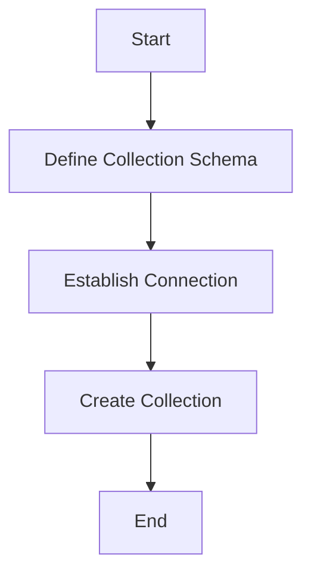
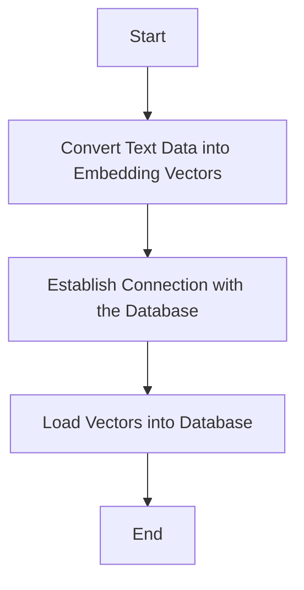
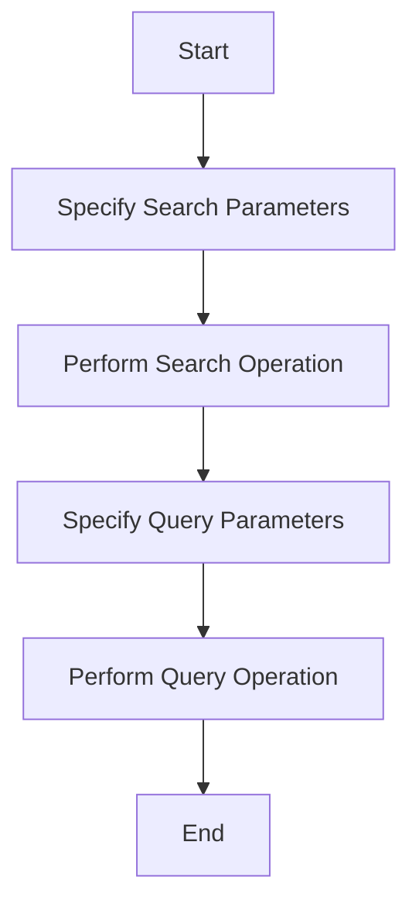

# Working with Vector Databases - a vector search example

Milvus is an open-source vector database that is highly reliable for similarity search. Let's look at how we can use it.

## Let's start with some base definitions

### Step 1 : create a collection
In Milvus, a collection is similar to a table in a traditional relational database. It's the primary organizational unit for storing data. A collection is formed of one or several vectors, as well as attributes that are logically grouped together. Creating a collection is necessary because it forms the foundation for storing data in Milvus.


### Step 2 : create vectors and save them into the collection

Embedding vectors are essentially lists of numbers used to represent various types of data, like images, words, or even collections of text. We create embedding vectors when we want to convert our text data into a form that a machine learning model can understand and process.

After creating these vectors, we then load them into a vector database, which is a type of database that uses vectors (instead of text) as its primary data representation format. This is useful as it allows for efficient storage and retrieval of high-dimensional vector data.




### Step 2 : search and query your data from your vector db
Finding and searching data in Milvus involves using the search function on our collection. What we search for depends on the specific use case - for example, if we're working with a book collection, we might want to search for books with a specific word count, or perhaps we want to fetch all books that contain a specific sentence.

After finding the data, we can proceed to query it. Querying involves extracting specific data from our search results according to certain conditions.

Here's a flow-diagram to visualize this process better:



## Let's start using python

### Creating a collection in Milvus

A collection is like a table in a relational database and is a basic data organization unit in Milvus. A collection contains a group of vectors and attributes that are logically grouped together. Let's start by creating one:

* Imports necessary

```python
from pymilvus import connections, utility
from pymilvus import Collection, DataType, FieldSchema, CollectionSchema
import configparser
```

* Retrieving the collection details

```python
bert_model_dir='/pyapp/models/multi-qa-MiniLM-L6-cos-v1/'
collection_name = "book"
```

* Establishing connection

```python
cfp = configparser.RawConfigParser()
cfp.read('config.ini')
milvus_uri = cfp.get('milvus_ristobot', 'uri')
token = cfp.get('milvus_ristobot', 'token')

connections.connect("default",
                    uri=milvus_uri,
                    token=token)
print(f"Connecting to DB: {milvus_uri}")
```

 * Creating a collection by defining fields

```python
dim = 384
book_id_field = FieldSchema(name="book_id", dtype=DataType.INT64, is_primary=True, description="customized primary id")
word_count_field = FieldSchema(name="word_count", dtype=DataType.INT64, description="word count")
book_intro_field = FieldSchema(name="book_intro", dtype=DataType.FLOAT_VECTOR, dim=dim)
schema = CollectionSchema(fields=[book_id_field, word_count_field, book_intro_field],
                    auto_id=False,
                    description="my first book collection")
print(f"Creating collection: {collection_name}")
collection = Collection(name=collection_name, schema=schema)
print(f"Schema: {schema}")
print("Success!")
```

Now that we have created a collection let's move to the next step - creating embeddings using BERT. 

### Creating Embedding Vectors with BERT

BERT, which stands for Bidirectional Encoder Representations from Transformers, is a neural network-based technique for natural language processing. As we have text data from books, let's create embeddings using BERT:

```python
from sentence_transformers import SentenceTransformer
```

* BERT model instantiation

```python
model = SentenceTransformer(bert_model_dir)
```

* Sentences to be converted into embeddings

```python
sentences = [
    "mela",
    "pera",
    "banana"
]
```
* Converting the sentences into embeddings

```python
sentence_embeddings = model.encode(sentences)
print("Embeddings generated!")
```

We now have our embeddings! The next step is inserting these into our Milvus collection.

### Inserting Embeddings into the Collection

Let's now insert the embeddings that we created using BERT into our Milvus collection:


* Inserting data with customized ids

```python
book_ids = list(range(3))
insert_rounds = 2

entities = [book_ids, word_counts, [embedding.tolist() for embedding in sentence_embeddings], sentences]
```

* Inserting the data into our collection

```python
t0 = time.time()
collection.insert(entities)
t1 = time.time()
print(f"Data inserted in {round(t1-t0, 4)} seconds!")
```

Now that all our embeddings are safely inside our Milvus collection, let's create an index for them.

### Indexing the Collection

A collection index enables efficient search operations. Now that we've inserted the vectors, let's index them:

* Creating index

```python
index_params = {"index_type": "AUTOINDEX", "metric_type": "L2", "params": {}}
```

* Self-constructed index
```python
print("Building AutoIndex...")
collection.create_index(field_name=book_intro_field.name, index_params=index_params)
t1 = time.time()
print(f"Index created in {round(t1-t0, 4)} seconds!")
```

Well done, we just indexed our collection. Now, let's conduct a search within our indexed collection.

### Searching the Collection

Let's try to perform a search operation on our collection:

* Searching

```python
search_str = "pera"

nq = 1
search_params = {"metric_type": "L2",  "params": {"level": 2}}
topk = 1

search_vec = [model.encode([search_str])[0].tolist()]                         

results = collection.search(search_vec,
                            anns_field=book_intro_field.name,
                            param=search_params,
                            limit=topk,
                            )
print(f"Result:{results}")
```
Great! We found the results from our search operation. Let's end this tutorial with a bang by performing a data query on our collection.

### Querying the Data

Now that we have our collection and its index, we can use the query method to search for specific vectors:

* Query
```python
given_id = matched_book_id   
res = collection.query(
  expr = f"book_id == {given_id}",
  output_fields = ["book_id", "word_count","sentence"]
)
```

* Checking the query result

```python
for item in res:
    print(f"book_id: {item['book_id']},  word_count: {item['word_count']} ,  sentence: {item['sentence']}")
```
And that's it! We've successfully gone through all the steps involved in using the Milvus vector database for a book collection, from creating a collection, creating embeddings with BERT, inserting these into our collection, creating an index, performing a search, and finally querying the data. 


## Let's use github project

You should have docker installed in your environment

    git clone https://github.com/morandalex/vector-search-example.git

    make up # this will build the python dependencies. You will need some minutes to build, so be patient. Run this command only once.

    make test # this command will test the test.py script

You will have the following output

```
make test
docker compose run -w /pyapp python python test.py  --remove-orphans
[+] Building 0.0s (0/0)                                                                                                                                                                             docker:desktop-linux
[+] Building 0.0s (0/0)                                                                                                                                                                             docker:desktop-linux
Connecting to DB: https://.......api.gcp-us-west1.zillizcloud.com
Success!
Creating ristobot collection: book
Schema: {'auto_id': False, 'description': 'my first book collection', 'fields': [{'name': 'book_id', 'description': 'customized primary id', 'type': <DataType.INT64: 5>, 'is_primary': True, 'auto_id': False}, {'name': 'word_count', 'description': 'word count', 'type': <DataType.INT64: 5>}, {'name': 'book_intro', 'description': '', 'type': <DataType.FLOAT_VECTOR: 101>, 'params': {'dim': 384}}, {'name': 'sentence', 'description': 'book sentence', 'type': <DataType.VARCHAR: 21>, 'params': {'max_length': 2000}}]}
Success!
Inserting 10 entities... 
Generate sentence embeddings using the SentenceTransformer model
Prepare data
Succeed in 0.321 seconds!
Flushing...
Succeed in 3.6852 seconds!
Building AutoIndex...
Succeed in 1.6364 seconds!
Loading collection...
Succeed in 4.3029 seconds!
Searching for 'pera'...
Result:["['id: 1, distance: 0.7175177335739136, entity: {}']"]
search latency: 0.2129 seconds!
hit id:  id: 1, distance: 0.7175177335739136, entity: {}
hit id:  1
hit distance:  0.7175177335739136
Matched Sentence: this is a intro about a book with name pera
book_id: 1,  word_count: 8 ,  sentence: this is a intro about a book with name pera

```

The logs shows that we created a collection with 4 columns `with id`, `words_count`, `book_intro`, `sentence`

`id` is the primary key 
`words_count` is a fake field used to test a random inserted number
`book_intro` is the sentence transfomed in a vector
`sentence` is the sentence. for this test we used three sentences that contain 5 different fruits : mela,pera,banana,mango,caco

When the collection with data is loaded than it is performed and indexing process.
After that, we load the collection and we make a search request embedding a word, in this case "pera"
Milvus gives back a vector with an id
We use the given id to query the db and get back the sentence as varchar.

